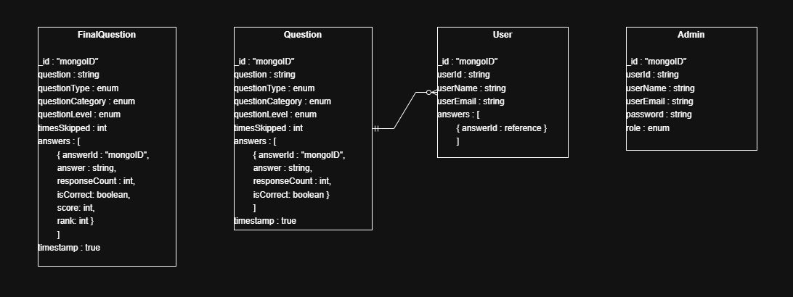

# **SBNA Game Show**

# Question & Answer Schema  

Entity Relation Diagram

**By: Austin Sinclair, Ayushi Patel – Team Pathfinder**

**Database:** MongoDB

**Collections:** Questions, Answers

**Rationale:** As of June 2nd, we have a newer and more thorough ER diagram to present. This diagram reworks the idea of a separate Answer and Question collection, instead having answers directly embedded into the Question documents. We have also implemented a field to track whether a response is correct or not, to be updated by admins. 

**Question**

Question will have several fields for sorting purposes, such as question type to differentiate between MCQ, Input, or any future type.

Question Category will act as a genre for the questions, in case there are certain genres that are requested or needed for individual games.

Question Level will track difficulty levels, and allow survey users to answer questions according to their comfort level.

Times Skipped is a field that will be used for analytics, allowing an admin team to see how often a certain questions is skipped. Maybe it is not a good question?

Answers will be an array of answer documents, each with their own unique MongoDB ID, and the answer text. When a new answer enters the data base, a new answer document will be created. If an answer already exists, the responseCount field will increment by one. This functionality allows us to avoid a bloated database while still tracking unique answers and their respective counts.

**FinalQuestion**

This collection will be the same as the question collection, but will only include questions being used for the show and the responses that have been deemed correct. Score and Rank for each response will be stored in this collection?

**Users**

This collection is fairly straight-forward, with fields like id, name, and email tracking a unique user interaction. Due to the nature of surveys, we do not want to implement an exhaustive log-in/verification process. This user category is simply for analytic purposes and allows us to track the answers and recurring users who participate very often.

**Admin**

Admins will follow a typical authentication and authorization process considering they will have certain roles for site maintenance and database operations. Depending on the role, admins will be able to insert, delete, or update questions, as well as having options to view questions and answers.

Hopefully this document gives other teams something to go off of when designing. We are more than welcome to suggestions.
